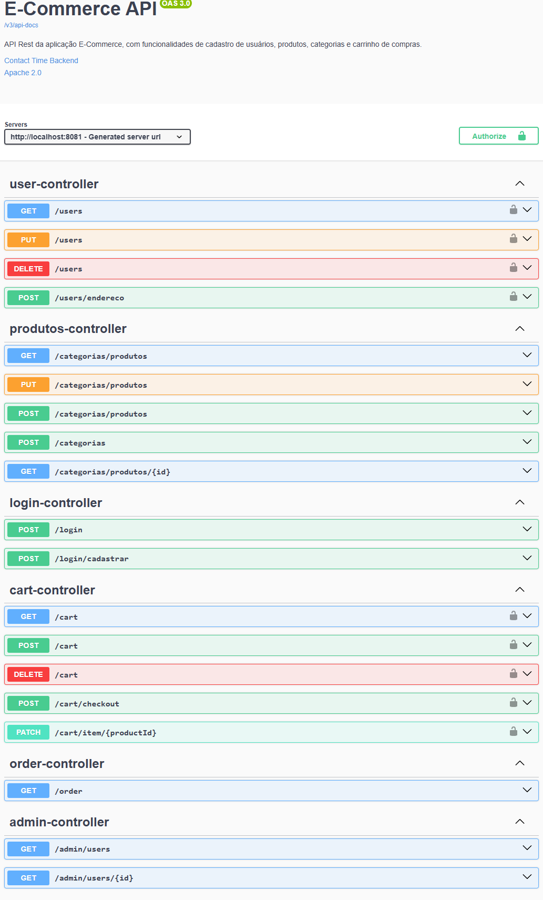

E-commerce - Back-End
Este é o back-end de um projeto de e-commerce para uma loja de roupas. Desenvolvido com Java e Spring Boot, o sistema fornece uma API RESTful para gerenciar produtos, usuários, carrinho de compras e pedidos. A autenticação é feita com tokens JWT, garantindo a segurança dos dados dos clientes. O banco de dados utilizado é PostgreSQL.

Funcionalidades
Gerenciamento de Produtos: Endpoints para adicionar, atualizar, remover e consultar produtos disponíveis na loja.
Autenticação e Autorização: Registro e login de clientes com segurança usando tokens JWT.
Gerenciamento de Usuários: Visualização e atualização dos dados pessoais e histórico de pedidos dos clientes.
Carrinho de Compras: Adição, remoção e atualização de itens no carrinho.
Processamento de Pedidos: Criação e atualização de pedidos com status como "PENDING", "PAID", "SHIPPED","DELIVERED".
Controle de Estoque: Atualização automática do estoque ao confirmar pedidos.
Endpoints Administrativos: Funções exclusivas para administradores, permitindo a gestão completa dos produtos e pedidos.
Tecnologias Utilizadas
Java 21: Linguagem de programação principal.
Spring Boot: Framework para construção do back-end.
Spring Security: Gerenciamento de autenticação e autorização.
JWT (JSON Web Token): Autenticação de usuários com tokens seguros.
Spring Data JPA: Mapeamento de dados para o banco de dados relacional.
PostgreSQL: Banco de dados para armazenamento de informações.
Docker: Contêineres para ambiente de desenvolvimento e produção.
Arquitetura do Projeto
O projeto segue a arquitetura em camadas, com a separação das responsabilidades da seguinte forma:

Controller: Define os endpoints da API e controla o fluxo de requisições e respostas.
Service: Implementa a lógica de negócios, como validações e regras específicas para cada entidade.
Repository: Responsável pela comunicação com o banco de dados via JPA.
Model: Classes que representam as entidades do sistema, como Produto, Usuario, Pedido e Carrinho.
Configuração do Projeto
Pré-requisitos
Java 21 ou superior
PostgreSQL
Docker (opcional)
Passo a Passo para Executar
Clone o repositório:

bash
Copiar código
git clone https://github.com/wesleywesp/E-commerce.git
cd loja-roupas-backend
Configuração do Banco de Dados:

Crie um banco de dados PostgreSQL e configure o nome, usuário e senha no arquivo application.properties:
properties
Copiar código
spring.datasource.url=jdbc:postgresql://localhost:5432/loja_roupas
spring.datasource.username=seu_usuario
spring.datasource.password=sua_senha
Configuração de JWT:

Defina uma chave secreta para o JWT no application.properties:
properties
Copiar código
jwt.secret=SuaChaveJWTSecreta
Construção e Execução do Projeto:

Execute o projeto com Maven:
bash
Copiar código
./mvnw spring-boot:run
Documentação da API:

A documentação da API pode ser acessada em http://localhost:8081/swagger-ui.html .
Endpoints Principais
Autenticação
POST /auth/register: Registro de novos usuários.
POST /auth/login: Login de usuários, retornando um token JWT.
Produtos
GET /categorias/produtos: Lista todos os produtos disponíveis.
POST /categorias/produtos: Adiciona um novo produto (apenas para administradores).
PUT /categorias/produtos/{id}: Atualiza um produto existente (apenas para administradores).
DELETE /categorias/produtos/{id}: Remove um produto (apenas para administradores).
Carrinho
POST /cart/: Adiciona um item ao carrinho.
DELETE /cart/remover: Remove um item do carrinho.
GET /cart: Lista os itens no carrinho.
PUT /cart/{produtoid}quantidade: Atualiza a quantidade de um item no carrinho.
POST /cart/checkout: Finaliza o pedido atual no carrinho.
Pedidos
POST /pedidos: Finaliza o pedido atual no carrinho.
GET /pedidos: Lista os pedidos do usuário autenticado.
Segurança
A autenticação é realizada com JWT. Um token é gerado no login e deve ser incluído no header Authorization (Bearer Token) em todas as requisições protegidas.
O Spring Security protege rotas específicas, permitindo acesso somente a usuários autenticados ou administradores, dependendo do endpoint.

